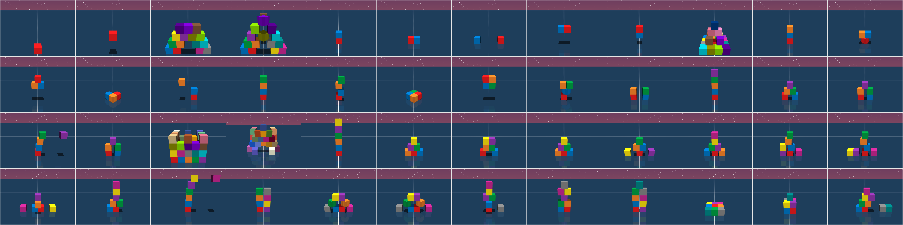

<div align="center">
  
<h1>BuilderBench</h1>

<br>


<p><sub><em><span style="color:grey">Can AI models build a world which today's generative models can only dream of?</span></em></sub></p>

<h2>
  <a href="https://arxiv.org/abs/2510.06288"><b>Paper</b></a> &ensp;·&ensp;
  <a href="https://rajghugare19.github.io/builderbench/"><b>Blogpost</b></a> &ensp;·&ensp;
  <a href="https://builderbench-leaderboard.github.io"><b>Leaderboard</b></a>
</h2>

</div>

BuilderBench is a benchmark to accelerate research into training that centers around exploration.  The vision for BuilderBench is to enable an open-ended stream of potential interactions, where pre-training could only ever cover a tiny slice of all possible behaviors. Our hypothesis is that the space of skills and discoveries that an agent has to know to build all possible structures is so vast, that it is impossible to memorize them at design time. This motivates the use of block-building to evaluate AI models in BuilderBench.

Please check out our [paper](https://arxiv.org/abs/2510.06288) for details about BuilderBench and check out the [blogpost](https://rajghugare19.github.io/builderbench/) to see the failure modes of some of the strongest models (as of March 2026). We encourage you to try new ideas and submit your solutions to the [live leaderboard](https://builderbench-leaderboard.github.io)!

Features include:
1. A simulated environment consisting of a robot interacting with building blocks.
2. A task suite of 51 tasks for evaluating AI models.
3. A wrapper for evaluating language model based agents.
4. Single interface for evaluating OpenAI, Claude and Gemini language models and open-source model.
5. Implementations of [Chain of Thought](https://arxiv.org/abs/2201.11903) and [Reflexion](https://arxiv.org/abs/2303.11366) agents.

# Installation

Prerequisites: [uv package manager](https://docs.astral.sh/uv/getting-started/installation/).

1. Clone the repository:
   ```bash
   git clone <repo-url>
   cd builderbench
   ```

2. Install the package and its dependencies:
   ```bash
   uv venv --python 3.12
   uv sync
   ```

3. Set up your API keys by creating a `SECRETS` file in the project root:
   ```
   OPENAI_API_KEY=your-openai-key
   ANTHROPIC_API_KEY=your-anthropic-key
   GEMINI_API_KEY=your-gemini-key
   ```
   The above step is not needed for self-hosted models via vLLM.

# Usage

Before running experiments, one must generate task meta-data files. To create task data (`.npz` files in `builderbench/tasks/`):
```bash
uv run python builderbench/create_task_data.py
```
This saves meta-data configurations for all tasks to `builderbench/tasks/`.


To run a Reflexion agent powered by GPT 5.2 on the cube-9-task-3:
```bash
uv run python run.py --client_name openai --model_id gpt-5.2-2025-12-11 --level_id cube-9-task-3 --agent_name cot --num_episode 3
```

To run a chain-of-thought agent powered by a self-hosted model (for e.g., Qwen3-4B-Instruct-2507) served via vLLM on the cube-1-task-1:
```bash
vllm serve Qwen/Qwen3-4B-Instruct-2507 --port 8080

uv run python run.py --client_name vllm --base_url http://localhost:8080/v1 --model_id Qwen/Qwen3-4B-Instruct-2507 --level_id cube-1-task-1 --agent_name cot
```

**Agents Implemented**

| Agent | File |
|---|---|
| Naive `naive` | [agents/naive.py](agents/naive.py) |
| Chain-of-thought `cot` | [agents/cot.py](agents/cot.py) |
| Reflexion `reflexion` | [agents/reflexion.py](agents/reflexion.py) |

# Leaderboard Submission

After running `run.py`, results are stored under:
```
outputs/<agent_name>/<model_id>/<level_id>-seed-<seed>-timestamp-<...>/
```

Each run directory contains `eval_summary.jsonl`, `run_config.json`, and `run_metadata.json`.

To generate a submission-ready file for a single task:
```bash
python submit.py \
    --results_dir outputs/ \
    --level_id cube-5-task-3 \
    --model_id your-model-id \
    --agent_name your-agent-name \
    --website_url https://your-model-url
```

`submit.py` aggregates results across seeds, runs a consistency check (task version, git commit, model ID must match across seeds), and writes a leaderboard ready JSON file to `tmp/<level_id>-leaderboard.json`. See [scripts/submit_claude_opus4.6.sh](scripts/submit_claude_opus4.6.sh) for an example script of how to submit all tasks for an agent at once.

Once the `tmp` folder is ready, follow the instructions in [leaderboard repository](https://github.com/RajGhugare19/builderbench-leaderboard.github.io) and make a new pull request. You need to place the `tmp` folder in the cloned repository and run `place_data.py` file in the [leaderboard repository](https://github.com/RajGhugare19/builderbench-leaderboard.github.io) and then make a new pull request.

# Paper Experiments

The scripts to replicate experiments from the paper are in the `scripts/` folder.

**Agents evaluated:**
- Claude Opus 4.6 — `reflexion` agent, 3 episodes
- Gemini 3 Flash Preview — `reflexion` agent, 3 episodes
- GPT-5.2 — `cot` agent, 1 episode

**To run all tasks for a model:**
```bash
bash scripts/run_claude_opus4.6.sh
bash scripts/run_gemini_flash3.1.sh
bash scripts/run_openai_gpt5.2.sh
```

Tasks are processed in parallel (default is 1 job(s) in parallel) and logs are written inside the `scripts/` folder.

**To create submission-ready results:**
```bash
bash scripts/submit_claude_opus4.6.sh
bash scripts/submit_gemini_flash3.1.sh
bash scripts/submit_openai_gpt5.2.sh
```

Submission scripts read the results of completed runs from `outputs/` and calls `submit.py` for each task.

## RL experiments

The code for tabula-rasa RL experiments can be found in the [`rl/`](rl/) folder.

# Teleoperation

The [teleop](teleop/) folder provides two scripts for manually controlling the robot in any environment — useful for exploring tasks or debugging. You can control the robot using the keyboard or a slider based GUI window. See the [teleop readme](teleop/README.md) for details.

## Acknowledgements

1) [OGBench](https://github.com/seohongpark/ogbench) for providing the backbone code to control the robot.
2) [Balrog](https://github.com/balrog-ai/BALROG) for providing backbone code for the language model clients.
3) [MuJoCo](https://github.com/google-deepmind/mujoco) for the physics simulation.
4) [MuJoCo Menagerie](https://github.com/google-deepmind/mujoco_menagerie) for the robot model.

## Citation

```bibtex
@misc{ghugare2025builderbench,
      title={BuilderBench: The Building Blocks of Intelligent Agents}, 
      author={Raj Ghugare and Roger Creus Castanyer and Catherine Ji and Kathryn Wantlin and Jin Schofield and Karthik Narasimhan and Benjamin Eysenbach},
      year={2026},
      eprint={2510.06288},
      archivePrefix={arXiv},
      primaryClass={cs.AI},
      url={https://arxiv.org/abs/2510.06288}, 
}
```
